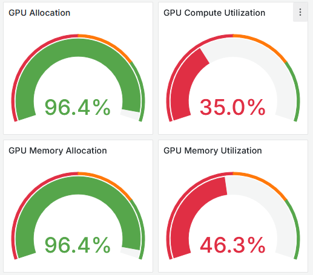
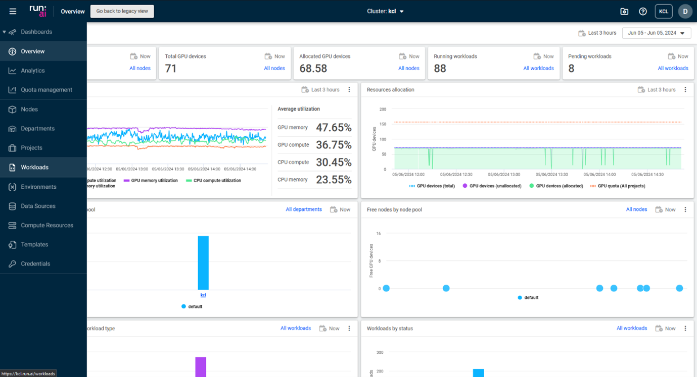

# DGX cluster guidelines

The most important aspect of fair and effective use of the GPU cluster is to balance and maximize GPU compute
utilization. This is vital, not just for fair usage amongst your colleagues, but also for improving the speed of your
own work.

GPU compute utilization refers to the percentage of a GPU's processing power actively used at a given time. This **DOES
NOT** refer specifically to the GPU memory (VRAM)  utilization. The important message is that the higher the GPU compute
utilization, the faster the job will get done. You should be aiming to have >90% compute utilization.

## The issue visualized

The below image shows a typical issue on the cluster. Almost all of the 71 gpus are allocated, yet their compute
utilization is 35%. If the average compute utilization were 90% then the exact same workload could be done on just 28
GPUs instead of 71, and they would each be done faster too.



---

## Section 1: How to check GPU utilization

There are multiple ways to check your GPU compute utilization, both on your local pc and on the DGX cluster.

### On local machine

On local machines the following command will show a GPU summary every 1 seconds (The key metric
being `VOLATILE GPU-Util`):

```shell
nvidia-smi -l 1
```

### On DGX cluster

For checking job utilization on the cluster a nice GUI representation is shown via the RunAI dashboard. Simply follow
`Workloads` -> `<your job name>` -> `metrics` -> `GPU compute utilization`



Third party alternatives which allow easy tracking and visualization of desired metrics, also automatically monitor
resource usage too (Free to use). Such examples are [Weights & Biases](https://wandb.ai/site),
[neptune.ai](https://neptune.ai/).

---

## Section 2: How to Optimize GPU utilization

Achieving maximum GPU compute utilization during deep learning training can be done a number of ways.

### 1. Make the most of the pytorch dataloader: [torch.utils.data.DataLoader](https://pytorch.org/docs/stable/data.html#torch.utils.data.DataLoader)

This includes:

- Setting `batch_size` to as high as possible before reaching an OOM error (VRAM too full to fit all data). This
  maximizes the time the GPU spends on performing computations, before having to wait for more data to be loaded.
- Setting `num_workers` > 0 to use multiple cpu cores for loading data. This is to minimize the time spent by the GPU
  waiting idly for the CPU to transfer data to it for processing.
- Raising value of `prefetch_factor`.
- Setting `pin_memory=True`
- Setting `persistent_workers=True`

A good default dataloader may look like this:

```python
my_dataloader = torch.utils.data.DataLoader(my_dataset,
                                            batch_size= < max_batchsize >,
num_workers = < num_cpu_cores >,
prefetch_factor = 4,
pin_memory = True,
persistent_workers = True)
```

### 2. No brainer code tweaks

There are a number of easy changes you can use to greatly improve training speed of your models, while changing
absolutely nothing about how your network trains/ how you debug. The recommendation would be to always use these
suggested options, no matter what you do.

These include:

- Using `model.zero_grad(set_to_none=True)` instead of `model.zero_grad()`
- Disable bias for convolutions directly followed by a batch norm i.e. `torch.nn.Conv2d(..., bias=False, ....)`
- Using `torch.backends.cudnn.benchmark = True` to automatically find fastest convolution algorithm.
- Create tensors directly on the target device e.g. Instead of calling `torch.rand(size).cuda()` instead
  use `torch.rand(size, device='cuda')`
- Setting `torch.backends.cuda.matmul.allow_tf32 = True` and `torch.backends.cudnn.allow_tf32 = True`. This allows
  pytorch to use the tensor processing cores on newer GPU architectures for matrix multiplication and convolutions.
- Disabling gradient calculation for validation or inference using `torch.no_grad()`. Typically, gradients aren’t needed
  for validation or inference.
- Consider replacing a manual implementation of the attention mechanism
  with `torch.nn.functional.scaled_dot_product_attention`. It calculates eactly the same thing but uses tricks under the
  hood to perform a much more efficient calculation, while better utilizing your hardware.

### 3. code tweaks to think about

There are also a number of code tweaks which you can implement cautiously.

These include:

- Using `torch.nn.parallel.DistributedDataParallel` instead of `torch.nn.DataParallel`. This is recommended best
  practise by Pytorch themselves and offers much better performance/scaling. A simple example of how to
  use `torch.nn.parallel.DistributedDataParallel` is shown in `ddp_example.py`. Further documentation can be
  found [here](https://pytorch.org/docs/stable/generated/torch.nn.parallel.DistributedDataParallel.html#torch.nn.parallel.DistributedDataParallel).
- Performing data augmentations on the gpu, instead of the cpu. By default pytorch will perform the selected data
  augmentations on the cpu instead of the gpu, and this is a particular performance drain for computationally expensive
  augmentations e.g. warping 3d data. The data can be moved to the gpu and a custom augmentation function can be coded
  using pytorch to then automatically perform the computation on the gpu. A simple example of how to perform GPU based
  data augmentations can be found in `gpu_data_augmentations.py`.
- Enabling channels_last memory format for vision models if there are no hard coded operations on exact tensor
  dimensions in your code e.g. `my_data = my_data.to(memory_format=torch.channels_last)`. Take care to also make sure
  that your model is also in the same channels format e.g. `my_model = my_model.to(memory_format=torch.channels_last)`.
  Further details can be found [here](https://pytorch.org/tutorials/intermediate/memory_format_tutorial.html).
- Disabling debugging APIs. When you are finished coding/debuggin a model you don't need all the background activity of
  Pytorch checking everything is ok for debugging purposes. These options can be disabled
  using `torch.autograd.set_detect_anomaly(False)`, `torch.autograd.profiler.profile(enabled=False)`
  and `torch.autograd.profiler.emit_nvtx(enabled=False)`.
- Using torch automatic mixed precision. Most models can train/inference perfectly well in a reduced level of numerical
  precision, in theory doubling your compute speed while halving your memory consumption. Care should be taken to make
  sure your model is stable before relying fully on automatic mixed precision. It can be used as a context manager
  e.g. `with torch.autocast(device_type="cuda"):`. A simple example of how to automatic mixed precision is shown
  in `amp_example.py`. Further documention can be found [here](https://pytorch.org/docs/stable/amp.html#torch.autocast).
- Trying to compile your pytorch model when you are finished debugging. This is often prone to failure and should be
  wrapped in a try statement, however it can greatly improve speed. It can
  be initiated using `my_model = torch.compile(my_model)`

---

## Section 3: Putting it all together

A barebones example template script using all of the recommendations can be found in `simple_example.py`. Another script
based upon `simple_recommendations_example.py` which has some more complexity added for better quality of life
is `fancy_recommendations_example.py`